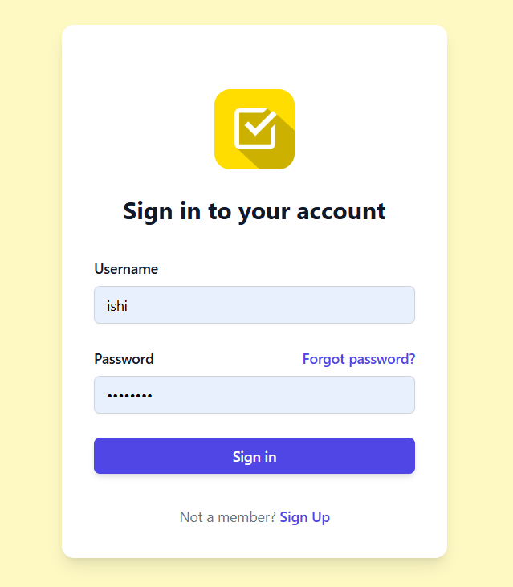
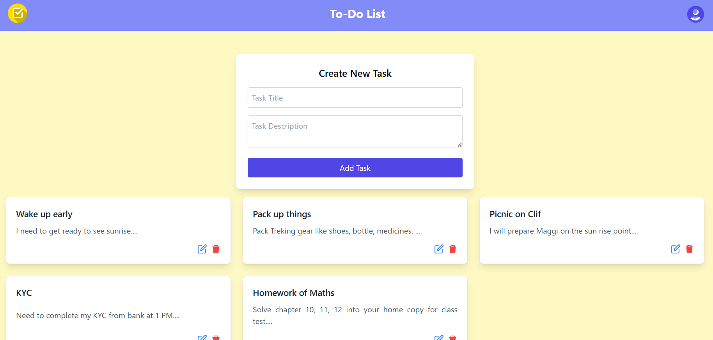
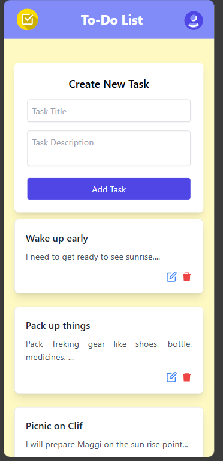
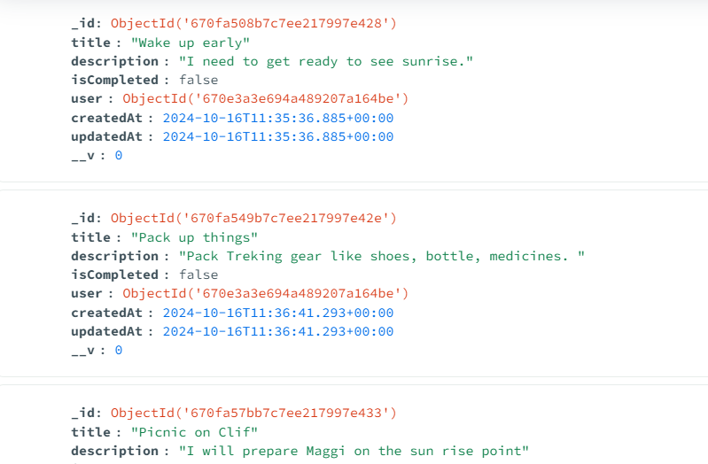
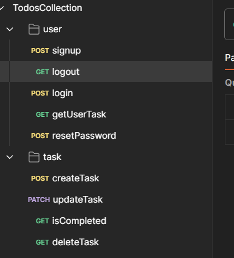

# TODO Full Stack Application

A full-stack task management application that enables users to create an account, log in, manage tasks, and reset passwords securely.

## Table of Contents
- [Features](#features)
- [Tech Stack](#tech-stack)
- [Installation](#installation)
- [Backend Setup](#backend-setup)
- [Frontend Setup](#frontend-setup)
- [Environment Variables](#environment-variables)
- [Usage](#usage)
- [API Endpoints](#api-endpoints)
- [Project Structure](#project-structure)
- [Screenshots](#screenshots)

## Features
- User Authentication (Signup, Login, Logout)
- Task Management (Add, Update, Delete tasks)
- Password Reset
- Protected Routes using JWT
- Responsive UI with Toast notifications for actions

## Tech Stack
- **Frontend**: React, Axios, Tailwind CSS, React-Router, React-Icons, Toastify
- **Backend**: Node.js, Express, MongoDB
- **Authentication**: JWT (Access & Refresh Tokens)

## Installation

### Prerequisites
- Node.js
- MongoDB

### Backend Setup
1. Navigate to the backend folder:
   ```bash
   cd backend
   ```
2. Install dependencies:
   ```bash
   npm install
   ```
3. Configure environment variables as specified below.
4. Start the server:
   ```bash
   npm start
   ```

### Frontend Setup
1. Navigate to the frontend folder:
   ```bash
   cd frontend
   ```
2. Install dependencies:
   ```bash
   npm install
   ```
3. Start the frontend:
   ```bash
   npm start
   ```

## Environment Variables
For backend configuration, create a `.env` file in the `backend` directory with the following variables:
```plaintext
PORT=8000
MONGODB_URI=your_mongodb_uri
JWT_SECRET=your_jwt_secret
CLIENT_URL=http://localhost:3000
```

## Usage
1. Signup or Login to access the tasks dashboard.
2. Add, update, and delete tasks directly on the dashboard.
3. Navigate to settings to reset your password.

## API Endpoints

### User Endpoints
- **POST** `/api/v1/users/signup`: Register a new user.
- **POST** `/api/v1/users/login`: Login with existing credentials.
- **GET** `/api/v1/users/logout`: Logout user.
- **POST** `/api/v1/users/reset-password`: Reset user password.

### Task Endpoints
- **GET** `/api/v1/users/usertask`: Get user’s task list.
- **POST** `/api/v1/users/addtask`: Add a new task.
- **PATCH** `/api/v1/users/updatetask/:id`: Update a task by ID.
- **DELETE** `/api/v1/users/deletetask/:id`: Delete a task by ID.

## Project Structure
```plaintext
root
│
├── backend
│   ├── controllers
│   ├── models
│   ├── routes
│   └── server.js
│
└── frontend
    ├── public
    ├── src
    │   ├── components
    │   ├── App.js
    │   └── index.js
    └── tailwind.config.js
```

## Screenshots
Add screenshots of your project here for a visual guide.





